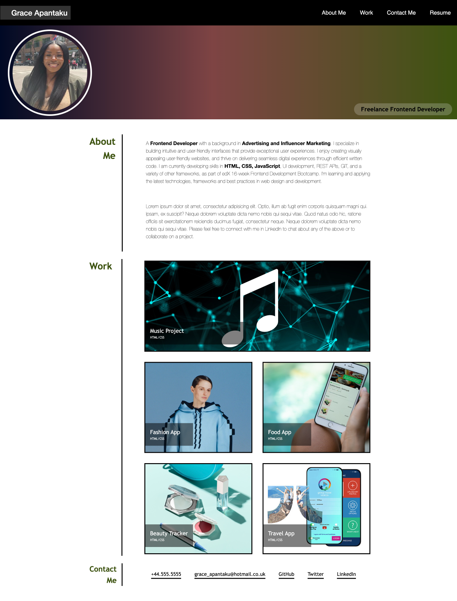

# Professional Web Development Portfolio

## Description

My professional web development portfolio featuring the below:

- An image of me
- A Navigation Bar which links to relevant sections on the webpage.
- An 'About Me' section detailing my previous work experience and current skill set
- A 'Portfolio' section showcasing five example projects. This section includes titled images of different sizes - with the first image being larger than the rest.
- Lastly there is an easy-to-find 'Contact Me' section with Facebook, LinkedIn, GitHub, Twitter.

## Technologies used

HTML  
CSS

## Installation

N/A

## Usage

## Screenshot

## License

MIT License

## Badges

HTML5

CSS3

## Features

- Hover function on the navigation links
- Hover function on the subtitle 'Freelance Frontend Developer'
- Navbar with links corresponding to relevant sections on the webpage
- Hyperlinked images for future projects
- Fully responsive web page - all screens

## Tests

N/A
